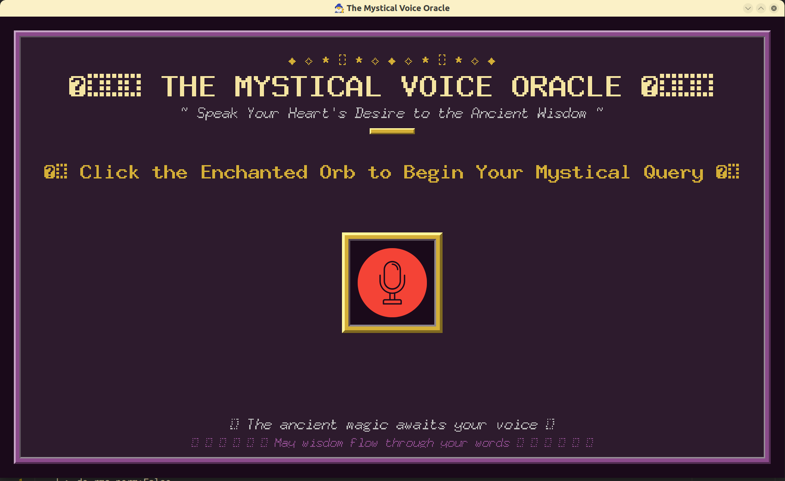

# SIMPLE AI Temen Curhat - Wizard Theme

[](https://www.python.org/downloads/)
[](LICENSE)
[](https://www.linux.org/)
[](https://github.com/olober76/simple-AI-Buddy)

**An advanced voice-activated AI assistant featuring real-time speech recognition, natural language processing, and  text-to-speech synthesis.**

> **⚠️ Platform Notice**: This application is currently optimised for **Linux environments**. Windows compatibility is under development.

---

## Table of Contents

- [Project Structure](#project-structure)
- [Overview](#overview)
- [Features](#features)
- [Architecture](#architecture)
- [Technology Stack](#technology-stack)
- [Prerequisites](#prerequisites)
- [Installation](#installation)
- [Configuration](#configuration)
- [Usage](#usage)
- [Voice Configuration](#voice-configuration)
- [Screenshots](#screenshots)
- [Demo Video](#demo-video)
- [Contributing](#contributing)
- [Changelog](#changelog)
- [Licence](#licence)

---
## Project Structure

```
AI_assistant/
├── app/
│   ├── assets/               # Static resources
│   │   ├── ai_icon.png
│   │   ├── mic.png
│   │   └── wizard.jpg
│   ├── config/               # Configuration management
│   │   ├── config.py         # Main configuration
│   │   └── model.py          # AI model settings
│   ├── service/              # Core business logic
│   │   ├── core.py           # Main service logic
│   │   ├── llama_process.py  # LLM processing
│   │   ├── tts_exec.py       # Text-to-speech engine
│   │   └── whisper_exec.py   # Speech recognition
│   ├── utils/                # Utility modules
│   │   ├── capture_the_voice.py      # Voice capture
│   │   ├── gui_Service.py            # Main GUI
│   │   ├── gui_Pop_Up_result.py      # Result display
│   │   ├── gui_Loading_Wizard.py     # Loading interface
│   │   └── gui_Voice_Selection.py    # Voice selection
│   ├── temp/                 # Temporary files
│   └── test/                 # Testing modules
├── screenshots/              # Application screenshots
├── main.py                   # Application entry point
├── requirements.txt          # Python dependencies
├── README.md                 # Project documentation
├── CHANGELOG.md              # Version history
└── TODO.md                   # Development roadmap
```

---


## Overview

This AI Voice Assistant represents a sophisticated conversational AI system that combines advanced speech recognition, natural language processing, and text-to-speech synthesis. The application provides users with an intuitive voice interface for engaging with AI models, featuring a GUI using `tkinter`.

The system architecture employs modular design principles, ensuring scalability and maintainability whilst delivering real-time performance for voice interactions.

---

## Features

### Core Functionality
- **🎤 Advanced Voice Recognition**: Real-time speech-to-text conversion with silence detection
- **🤖 AI Integration**: integration with Groq API for intelligent responses
- **🎵 Text-to-Speech**: voice synthesis features
- **⚡ Real-time Processing**: Optimised for low-latency voice interactions
- **🔄 Threaded Operations**: Non-blocking UI with background processing


---

## Architecture

The application follows a modular Model-View-Controller (MVC) architectural pattern:

```
┌─────────────────┐    ┌─────────────────┐    ┌─────────────────┐
│   Presentation  │    │    Business     │    │      Data       │
│     Layer       │    │     Logic       │    │     Layer       │
├─────────────────┤    ├─────────────────┤    ├─────────────────┤
│ • GUI Components│    │ • Audio Process │    │ • Configuration │
│ • User Interface│    │ • TTS Engine    │    │ • API Keys      │
│ • Event Handlers│    │ • AI Integration│    │ • Voice Models  │
│ • Visual Effects│    │ • Core Logic    │    │ • Temp Files    │
└─────────────────┘    └─────────────────┘    └─────────────────┘
```

### Component Breakdown

1. **Service Layer** (`app/service/`)
   - Core business logic and AI processing
   - Text-to-speech engine management
   - Audio processing and playback systems

2. **Utilities Layer** (`app/utils/`)
   - GUI components and user interface
   - Voice capture and audio recording
   - User interaction handlers

3. **Configuration Layer** (`app/config/`)
   - Application settings and API configuration
   - Voice personality definitions
   - Environment variable management

---

## Technology Stack

### Core Technologies
- **Python 3.8+**: Primary programming language
- **Tkinter**: GUI framework for desktop application

### AI and Machine Learning
- **Groq API**: Advanced language model integration
- **TTS (Text-to-Speech)**: Mozilla TTS for voice synthesis
- **VCTK Dataset**:  voice models for speech generation

### Audio Processing
- **SoundDevice**: Professional audio I/O library
- **SoundFile**: Audio file processing and manipulation  
- **PyAudio**: Alternative audio interface
- **FFmpeg**: Multimedia framework for audio processing

### Image Processing
- **Pillow (PIL)**: Image processing for GUI elements

### External Dependencies
- **ALSA/PulseAudio**: Linux audio system integration
- **System Audio Players**: Multiple fallback audio systems

---

## Prerequisites

### System Requirements
- **Operating System**: Linux (Ubuntu 18.04+ recommended)
- **Python Version**: Python 3.8 or higher
- **Memory**: Minimum 4GB RAM (8GB recommended)
- **Storage**: 2GB free space for models and dependencies
- **Audio System**: ALSA or PulseAudio configured

### Linux-Specific Dependencies
```bash
# Audio system libraries
sudo apt update
sudo apt install alsa-utils pulseaudio

# Audio development headers
sudo apt install libasound2-dev portaudio19-dev

# FFmpeg for audio processing
sudo apt install ffmpeg

# Python development tools
sudo apt install python3-dev python3-pip
```

### Hardware Requirements
- **Microphone**: USB or built-in microphone
- **Speakers/Headphones**: Audio output device
- **Network Connection**: Internet access for AI API calls

---

## Installation

### 1. Clone the Repository
```bash
git clone https://github.com/olober76/simple-AI-Buddy.git
cd simple-AI-Buddy
```

### 2. Create Virtual Environment
```bash
python3 -m venv ai_assistant_env
source ai_assistant_env/bin/activate
```

### 3. Install Dependencies
```bash
pip install -r requirements.txt
```

### 4. Verify Audio System
```bash
# Test microphone
arecord -d 5 test.wav && aplay test.wav

# Test PulseAudio
pulseaudio --check -v
```

### 5. Download TTS Models
```bash
# The application will automatically download required models on first run
python -c "from TTS.api import TTS; TTS('tts_models/en/vctk/vits')"
```

---

## Configuration

### Environment Variables Setup

Create a `.env` file in the project root:

```bash
# Groq API Configuration
GROQ_API_KEY=your_groq_api_key_here

# Optional: Audio Configuration
AUDIO_DEVICE_INDEX=0
AUDIO_SAMPLE_RATE=22050
```

### Obtaining API Keys

1. **Groq API Key**:
   - Visit [Groq Console](https://console.groq.com/keys)
   - Create an account or sign in
   - Generate a new API key
   - Copy the key to your `.env` file
---

## Usage

### Starting the Application

```bash
# Ensure virtual environment is activated
source ai_assistant_env/bin/activate

# Run the main application
python main.py
```

### Basic Operation

1. **Launch Interface**: The GUI will open with the main voice interface
2. **Voice Input**: Click the microphone button to start recording
3. **AI Processing**: Speak your question or request clearly
4. **Response**: The AI will process your input and respond with synthesised speech
5. **Continue**: The interface returns to idle state for the next interaction


### Troubleshooting Common Issues

```bash
# Audio device issues
python -c "import sounddevice as sd; print(sd.query_devices())"

# Test TTS functionality
python -c "from app.service.tts_exec import synthesize_audio_only; synthesize_audio_only('Test message')"

# Check API connectivity
python -c "from app.config.config import client; print('API connection successful')"
```

---

## Voice Configuration


### Custom Voice Integration

To add additional voices:

1. Identify compatible VCTK speaker IDs
2. Add configuration to `app/config/config.py`
3. Update the voice selection interface
4. Test voice quality and performance

---

## Screenshots

### Main Interface (Idle State)




### AI Response Display


---

## Demo Video

### Application Demonstration


| **Preview Video**                                                                                                  |
| ------------------------------------------------------------------------------------------------------------------ |
| <video  width=900 height=450 src=https://github.com/user-attachments/assets/e4002e78-b07d-42db-9cd9-777cf108bdf5 > |


---

## Contributing

We welcome contributions to improve the AI Voice Assistant. Please follow these guidelines:

### Development Setup

1. Fork the repository
2. Create a feature branch
3. Set up the development environment
4. Make your changes with appropriate tests
5. Submit a pull request with detailed description


---

## Changelog

For detailed information about changes, improvements, and version history, please refer to the [CHANGELOG](./CHANGELOG.md).

---

## Licence

This project is licensed under the MIT License - see the [LICENSE](LICENSE) file for details.

---


*This project is actively maintained and developed. For the latest updates and releases, please visit the  profile [GitHub repository](https://github.com/olober76/).*

